# Studio Images Folder

This folder contains all customizable images for the Wedding Theme Studio website.

## Folder Structure

```
public/
├── studio-images/
│   ├── owner-1.jpg          ← Owner/Visionary image 1
│   ├── owner-2.jpg          ← Owner/Visionary image 2
│   ├── owner-3.jpg          ← Owner/Visionary image 3
│   │
│   ├── portfolio-hindu-1.jpg
│   ├── portfolio-hindu-2.jpg
│   ├── portfolio-sikh-1.jpg
│   ├── portfolio-sikh-2.jpg
│   ├── portfolio-muslim-1.jpg
│   ├── portfolio-muslim-2.jpg
│   ├── portfolio-destination-1.jpg
│   ├── portfolio-destination-2.jpg
│   ├── portfolio-prewedding-1.jpg
│   ├── portfolio-prewedding-2.jpg
│   ├── portfolio-cinematic-1.jpg
│   ├── portfolio-cinematic-2.jpg
│   │
│   ├── film-thumb-1.jpg     ← Wedding film thumbnail 1
│   ├── film-thumb-2.jpg     ← Wedding film thumbnail 2
│   ├── film-thumb-3.jpg     ← Wedding film thumbnail 3
```

## How to Add Images

### 1. Owner/Visionary Images (About Page)
Add your images and name them exactly:
- `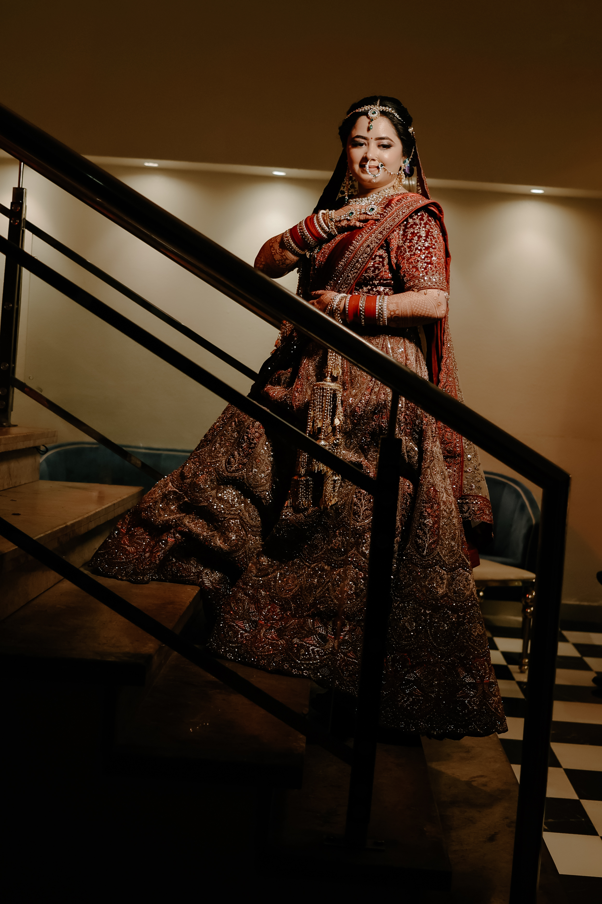 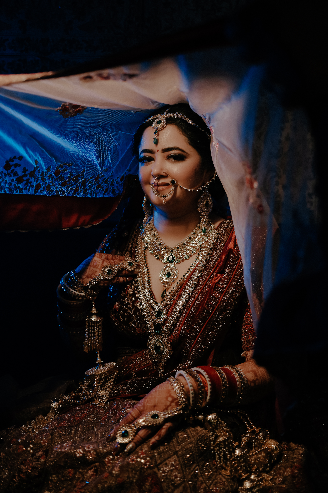 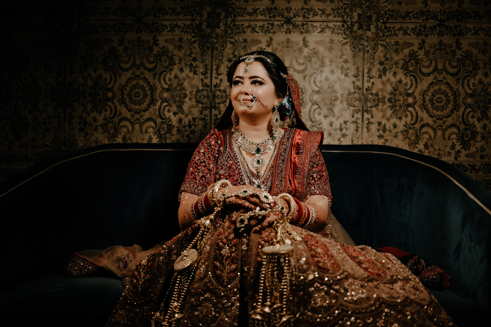 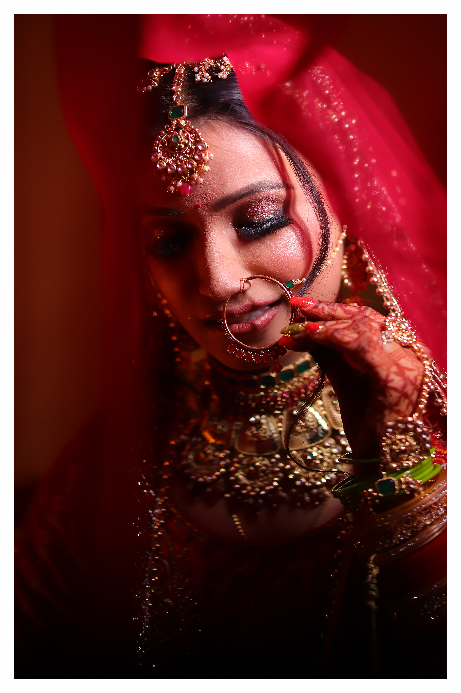 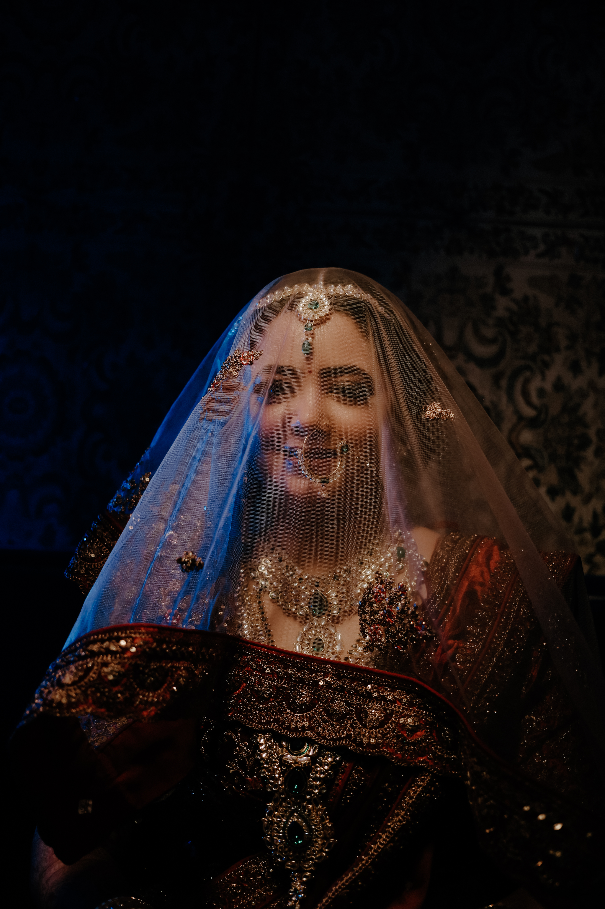 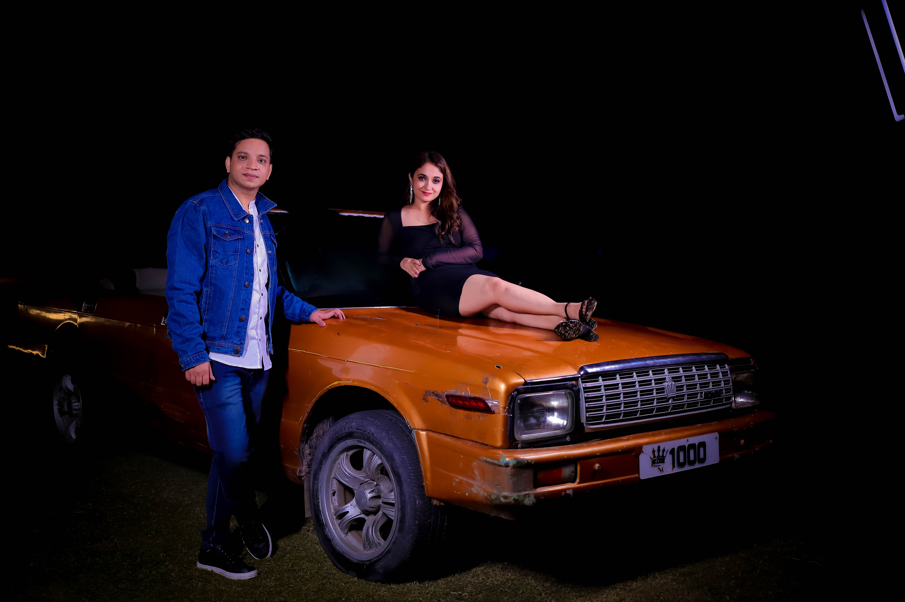 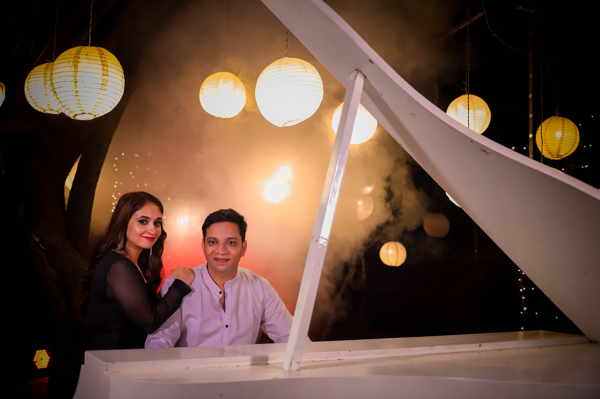 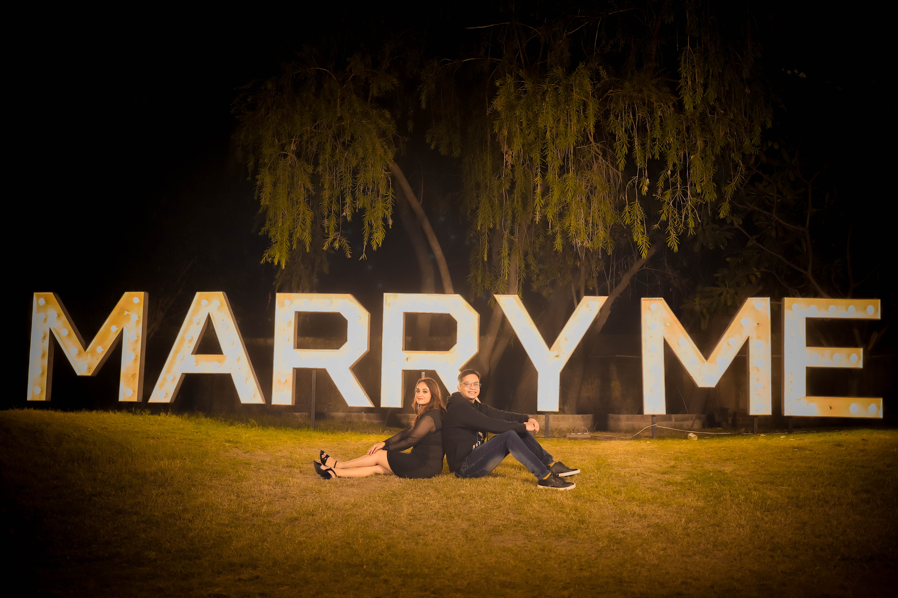 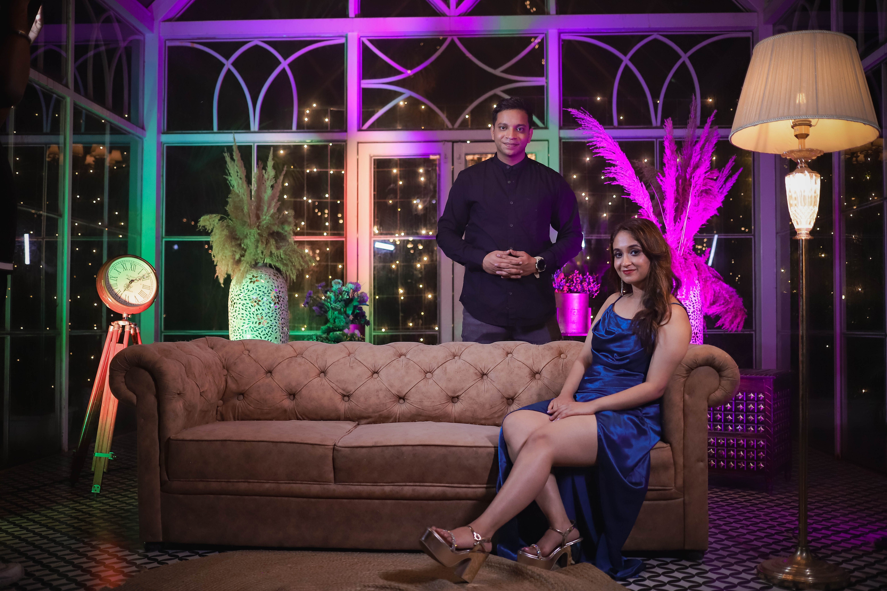 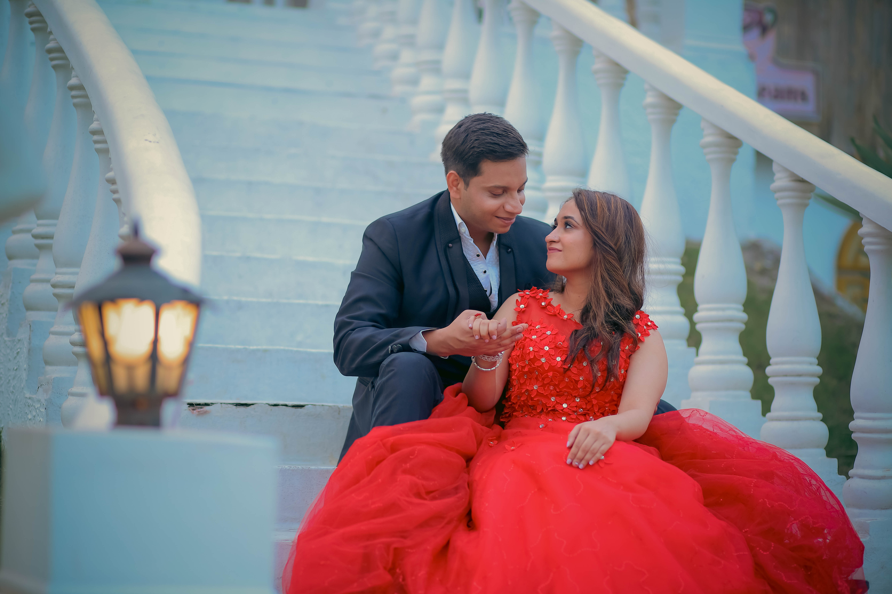 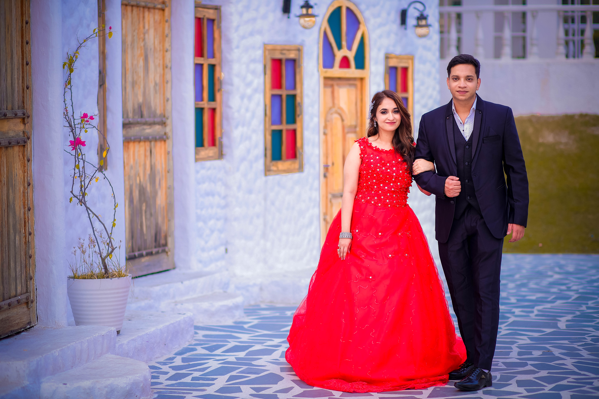 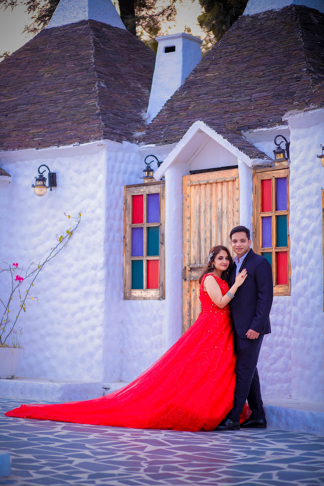 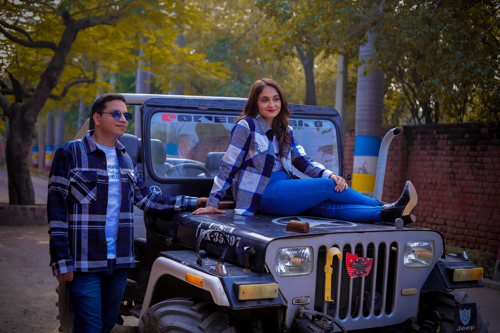 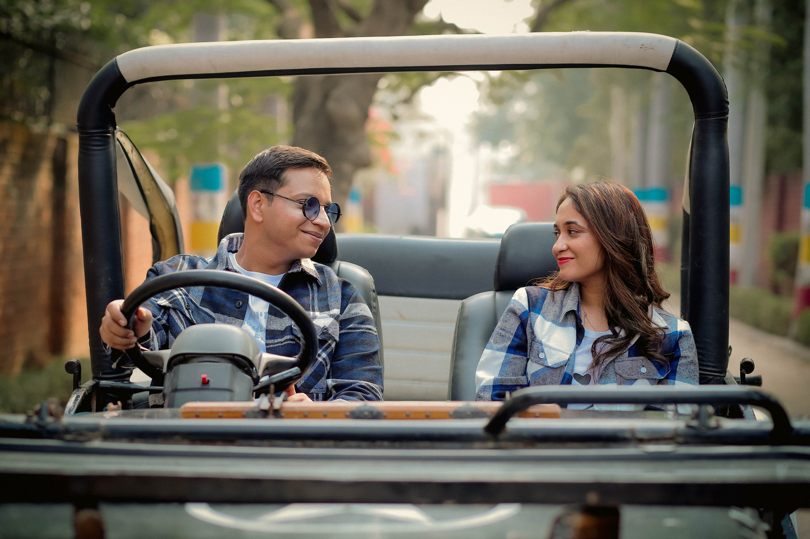

### 2. Portfolio Images
Name images according to category:
- Hindu Wedding: `portfolio-hindu-1.jpg`, `portfolio-hindu-2.jpg`
- Destination: `portfolio-destination-1.jpg`, `portfolio-destination-2.jpg`
- Pre-Wedding: `portfolio-prewedding-1.jpg`, `portfolio-prewedding-2.jpg`
- Cinematic: `portfolio-cinematic-1.jpg`, `portfolio-cinematic-2.jpg`
- 

### 3. instagram embled link 
- `film-thumb-1.jpg`
- `film-thumb-2.jpg`
- `film-thumb-3.jpg`

## Supported Formats
- JPG (.jpg, .jpeg)
- PNG (.png)
- WebP (.webp) ← Recommended for best quality & performance

## Recommended Sizes

| Image Type | Recommended Size | Aspect Ratio |
|------------|----------------|--------------|
| Owner Images | 1200 x 1600px | 3:4 Portrait |
| Portfolio | 800 x 1000px | 4:5 Portrait |
| Landscape | 1920 x 1080px | 16:9 |
| Film Thumbnail | 1280 x 720px | 16:9 |

## Tips for Best Results

1. **Use WebP format** for faster loading
2. **Compress images** before uploading (use TinyPNG or Squoosh)
3. **Use descriptive names** for organization
4. **Add images gradually** - you can test with one image at a time

## Updating Configuration

To change links and text, edit:
`src/config/siteConfig.ts`

This file contains all configurable text, links, and image paths for the entire site.
